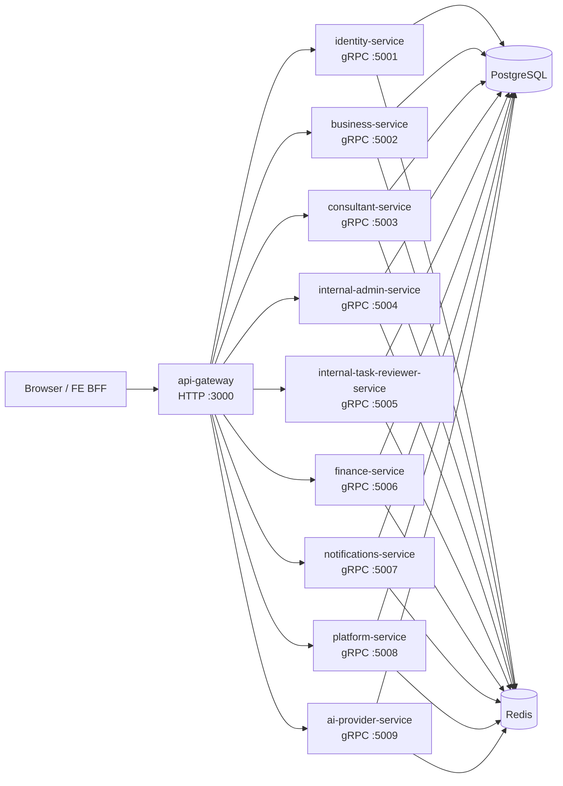

# Plys Marketplace Monorepo

Backend for a two-sided marketplace connecting **businesses** (project owners on **Ployos**) and **consultants** (freelance professionals on **Lonaos**).

This repository is an **Nx + pnpm monorepo**. The HTTP edge is `apps/api-gateway`; domain logic runs in nine gRPC microservices. Shared code lives in `@plys/libraries` under `packages/`.

---

## Tech Stack

| Layer             | Technology                                           |
| ----------------- | ---------------------------------------------------- |
| Runtime           | Node.js 22 LTS                                       |
| Monorepo          | pnpm workspaces + Nx 20                              |
| Framework         | NestJS 11 (Fastify adapter on the gateway)           |
| Language          | TypeScript 5                                         |
| Inter-service RPC | gRPC (`@nestjs/microservices`, `@grpc/grpc-js`)      |
| Database          | PostgreSQL 16                                        |
| ORM               | TypeORM 0.3                                          |
| Cache / queues    | Redis 7+ (ioredis, Bull, throttling)                 |
| Auth              | JWT (access + refresh), Google OAuth 2.0 (SSO)       |
| Realtime          | Socket.io (notifications via notifications-service)  |
| Email             | Resend                                               |
| Payments          | Polar or Stripe (configurable)                       |
| File storage      | Local disk or AWS S3                                 |
| AI                | OpenAI, Groq, Google Generative AI                   |
| Validation        | class-validator + class-transformer                  |
| API docs          | Swagger / OpenAPI (`@nestjs/swagger`)                |
| i18n              | nestjs-i18n — English (`en`) and Turkish (`tr`)      |
| Logging           | Winston (`nest-winston`)                             |
| Containerization  | Docker + Docker Compose                              |
| CI/CD             | GitHub Actions → GHCR → VPS (PM2 supervises compose) |
| Versioning        | Changesets (`@plys/libraries`)                       |

---

## Project Architecture

### High-level flow

Clients (Ployos, Lonaos, and Plys Internal Hub) talk only to the **API gateway** over REST and WebSocket. The gateway forwards requests to backend services over **gRPC**. All services share one PostgreSQL schema and Redis cluster during the current migration phase.



### Services

| Service                          | Port        | Responsibility                                                               |
| -------------------------------- | ----------- | ---------------------------------------------------------------------------- |
| `api-gateway`                    | 3000 (HTTP) | REST edge, JWT/session context, rate limiting, Swagger, gRPC client dispatch |
| `identity-service`               | 5001        | Auth, SSO, sessions, users, admin auth                                       |
| `business-service`               | 5002        | Business profiles, onboarding, projects, tasks (Ployos)                      |
| `consultant-service`             | 5003        | Consultant profiles, onboarding, skill exams, explore, membership (Lonaos)   |
| `internal-admin-service`         | 5004        | Admin onboarding review, skill exam admin, business/consultant admin         |
| `internal-task-reviewer-service` | 5005        | Task review rounds, voting, completion payout orchestration                  |
| `finance-service`                | 5006        | Wallets, payments, billing, payment webhooks                                 |
| `notifications-service`          | 5007        | Notification persistence, event handlers, skill-match queue                  |
| `platform-service`               | 5008        | Files, skills taxonomy, health                                               |
| `ai-provider-service`            | 5009        | AI provider keys, chat sessions, project AI context                          |

Cross-service reads use gRPC ports and `@plys/libraries/profiles-port` where applicable. See [docs/architecture/domain-ownership.md](docs/architecture/domain-ownership.md).

### Monorepo layout

```
apps/
├── api-gateway/                    # HTTP + WebSocket edge (no direct DB access)
├── identity-service/               # gRPC — auth domain
├── business-service/               # gRPC — Ployos domain
├── consultant-service/             # gRPC — Lonaos domain
├── internal-admin-service/         # gRPC — internal admin
├── internal-task-reviewer-service/ # gRPC — task reviews
├── finance-service/                # gRPC — finance domain
├── notifications-service/          # gRPC — notifications
├── platform-service/               # gRPC — files, skills, health
└── ai-provider-service/            # gRPC — AI provider keys & chat

packages/                           # @plys/libraries (single package, subpath exports)
├── proto/                          # Shared gRPC .proto contracts
├── database/                       # TypeORM entities, migrations, seeds
├── config/                         # Env file resolution
├── common-nest/                    # Guards, filters, interceptors, EnvironmentsService
├── unit-of-work/                   # Repository layer + domain UoW modules
├── unit-of-work-core/              # AbstractUnitOfWork base
├── transaction-coordinator/        # Cross-service composite flows
├── shared-kernel/                  # Cross-service constants
├── ai-provider-key/                # AI provider key CRUD + BFF envelope
├── notifications/                  # NotificationsDispatchModule shim (→ notifications-service)
└── profiles-port/                  # Profiles reader/ledger port interfaces

docker/                             # Dockerfile, docker-compose*.yml
env/                                # .env.dev, .env.prod, .env.example
```

Import shared code via subpaths, e.g. `@plys/libraries/database`, `@plys/libraries/common-nest/guards/jwt-auth.guard`.

### Key design patterns

- **Unit of Work** — repository access goes through `UnitOfWorkService` (or domain-specific UoW modules). Services do not inject TypeORM repositories directly. Transactions use `uow.withTransaction(...)`.
- **Request context** — `RequestContextService` (AsyncLocalStorage) holds user identity (`userId`, `userRole`, `activePlatform`). No `@CurrentUser()` decorator; no `userId` parameters passed between layers.
- **Platform model** — `ActivePlatform.BUSINESS` (Ployos), `ActivePlatform.CONSULTANT` (Lonaos), and admin roles on Plys Internal Hub. `PlatformGuard` enforces platform scope per endpoint.
- **Standardized response** — `TransformResponseInterceptor` wraps every HTTP response in `{ status_code, message, error_code, data, timestamp, path }`. Controllers return `{ messageKey, data }`.
- **snake_case API** — JSON keys use `snake_case`. `@Expose({ name: 'camelKey' })` maps entity properties at the HTTP boundary.
- **i18n keys in DB** — skill names, categories, and industries are stored as i18n keys (e.g. `skill_react`). Translation happens per request locale.

### Further reading

| Doc                                                                                  | Contents                                      |
| ------------------------------------------------------------------------------------ | --------------------------------------------- |
| [docs/README.md](docs/README.md)                                                     | Documentation index                           |
| [docs/deployment/overview.md](docs/deployment/overview.md)                           | Docker, env files, CI/CD, PM2 per-service ops |
| [docs/deployment/setup.md](docs/deployment/setup.md)                                 | First-time VPS + GitHub setup guide           |
| [docs/architecture/system-architecture.md](docs/architecture/system-architecture.md) | Services, gRPC bridge, security, data layer   |
| [docs/architecture/domain-ownership.md](docs/architecture/domain-ownership.md)       | Table ownership and bounded contexts          |
| [docs/architecture/versioning.md](docs/architecture/versioning.md)                   | `@plys/libraries` semver via Changesets       |

---

## Setup Guide

### Requirements

| Tool       | Version                          |
| ---------- | -------------------------------- |
| Node.js    | 20.x LTS (`>=20.0.0`)            |
| pnpm       | 9.x (`>=9.0.0`)                  |
| Docker     | For PostgreSQL and Redis locally |
| PostgreSQL | 16 (via Docker Compose)          |
| Redis      | 7+ (via Docker Compose)          |

Install pnpm if needed:

```bash
npm install -g pnpm
```

### 1. Clone and install

```bash
git clone <repo-url>
cd plys-internal-hub-serivce-api
pnpm install
```

### 2. Configure environment

Env files live under **`env/`** and are shared by all apps.

```bash
cp env/.env.example env/.env.local
```

Fill in secrets in `env/.env.local`. Key variables:

| Variable               | Purpose                                                            |
| ---------------------- | ------------------------------------------------------------------ |
| `DEPLOY_ENV=local`     | Selects `env/.env.local` at runtime                                |
| `NODE_ENV=development` | Node runtime mode                                                  |
| `DB_*`                 | PostgreSQL connection (defaults match `docker/docker-compose.yml`) |
| `REDIS_*`              | Redis connection                                                   |
| `JWT_*`                | Access/refresh token secrets                                       |
| `*_GRPC_URL`           | gRPC addresses for each backend service                            |

See [env/.env.example](env/.env.example) for the full list. Committed templates: `env/.env.dev`, `env/.env.prod` (used on VPS). Never commit `env/.env.local`.

### 3. Start infrastructure

**Postgres + Redis only** (recommended for Nx serve):

```bash
pnpm docker:infra
```

**Full production simulation in Docker** (builds images, runs migrations, starts all 10 services):

```bash
pnpm docker:simulate
```

See [docs/deployment/overview.md](docs/deployment/overview.md) for `docker:build`, `docker:migrate`, `docker:up`, and `docker:down`.

### 4. Run database migrations

```bash
pnpm migration:run
```

### 5. Seed reference data

Seeds the skills taxonomy (ESCO-sourced) and admin allow-list. Safe to re-run (upsert semantics).

```bash
pnpm db:seed
```

In Docker deploys, the `migrate` image target runs migrations and seeds automatically.

To wipe the local schema (tables only, `DEPLOY_ENV=local` required):

```bash
pnpm db:drop
pnpm migration:run
```

### 6. Start services

**Option A — Nx serve** (hot reload, recommended for development):

```bash
pnpm docker:infra   # postgres + redis
nx run identity-service:serve                  # gRPC :5001
nx run business-service:serve                  # gRPC :5002
nx run consultant-service:serve                # gRPC :5003
nx run internal-admin-service:serve            # gRPC :5004
nx run internal-task-reviewer-service:serve     # gRPC :5005
nx run finance-service:serve                   # gRPC :5006
nx run notifications-service:serve              # gRPC :5007
nx run platform-service:serve                  # gRPC :5008
nx run ai-provider-service:serve               # gRPC :5009
nx run api-gateway:serve                       # HTTP :3000
```

Or start all at once:

```bash
nx run-many -t serve --projects=identity-service,business-service,consultant-service,internal-admin-service,internal-task-reviewer-service,finance-service,notifications-service,platform-service,ai-provider-service,api-gateway
```

**Option B — Production build**:

```bash
pnpm build
DEPLOY_ENV=local NODE_ENV=production node apps/api-gateway/dist/main.js
```

### 7. Verify

| Endpoint   | URL                               |
| ---------- | --------------------------------- |
| API base   | http://localhost:3000/api/v1      |
| Swagger UI | http://localhost:3000/api/v1/docs |

---

## Development Commands

| Command                                        | Description                                       |
| ---------------------------------------------- | ------------------------------------------------- |
| `pnpm build`                                   | Build all apps and `@plys/libraries`              |
| `pnpm lint`                                    | ESLint across all Nx projects                     |
| `pnpm typecheck`                               | Typecheck packages and all apps                   |
| `pnpm test`                                    | Run all unit tests                                |
| `pnpm format`                                  | Prettier on `apps/` and `packages/`               |
| `pnpm affected`                                | Lint, test, and build only affected projects      |
| `nx graph`                                     | Visualize project dependency graph                |
| `pnpm migration:generate --name=MigrationName` | Generate a new TypeORM migration                  |
| `pnpm migration:revert`                        | Revert the last applied migration                 |
| `pnpm db:seed`                                 | Seed skills taxonomy and admin allow-list (local) |
| `pnpm db:drop`                                 | Drop and recreate `public` schema (local only)    |
| `nx run api-gateway:serve`                     | Start the HTTP gateway with hot reload            |
| `pnpm docker:simulate`                         | Build images, migrate, and run full stack locally |
| `pnpm docker:infra`                            | Start Postgres + Redis only                       |
| `nx run <service>:serve`                       | Start a single gRPC microservice                  |

---

## License

UNLICENSED — private repository.
