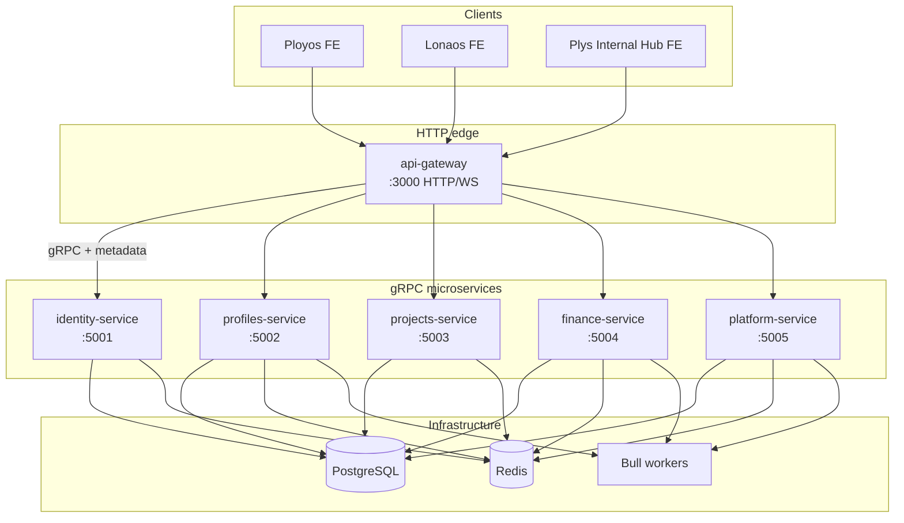
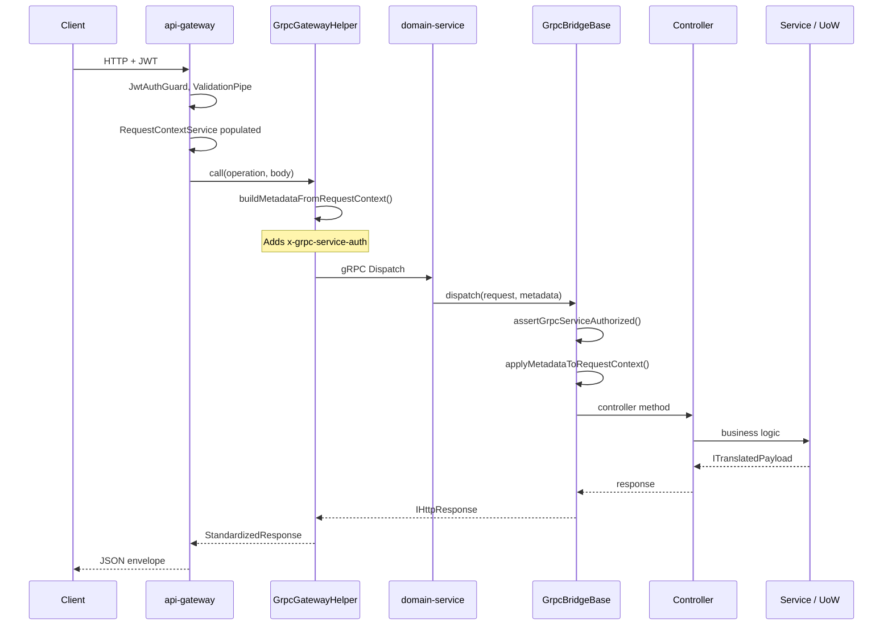
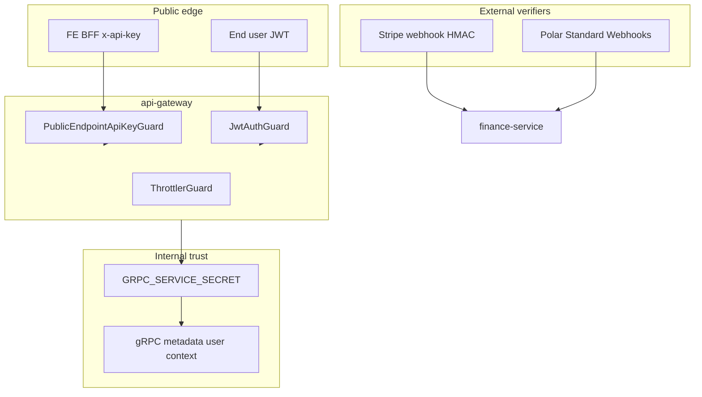
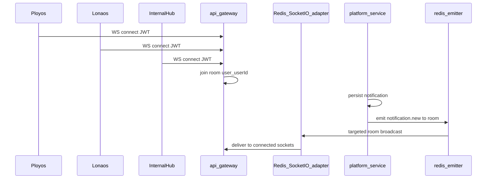

# System Architecture

This document describes how the Plys marketplace backend is structured: services, communication paths, shared libraries, security boundaries, and cross-cutting patterns. It reflects the current monorepo layout after the gRPC bridge, security hardening, and package-extraction work.

For table ownership and bounded contexts, see [domain-ownership.md](./domain-ownership.md). For deploy topology and env files, see [../deployment/overview.md](../deployment/overview.md).

---

## Overview

The backend is an **Nx + pnpm monorepo** with six runnable NestJS applications and shared libraries under `packages/`. Clients (**Ployos**, **Lonaos**, and **Plys Internal Hub**) talk **only to the API gateway** over HTTP and WebSocket. Domain logic runs in five **gRPC-only microservices** that share one PostgreSQL schema and one Redis cluster during the current migration phase.

| Layer                | Role                                                                              |
| -------------------- | --------------------------------------------------------------------------------- |
| **api-gateway**      | HTTP/WS edge — auth guards, validation, throttling, Swagger, gRPC client dispatch |
| **identity-service** | Users, JWT sessions, SSO, admin OTP auth                                          |
| **profiles-service** | Business/consultant profiles, onboarding, skill exams                             |
| **projects-service** | Projects, tasks, explore, AI context, chat sessions, reviews                      |
| **finance-service**  | Wallets, payments, billing, webhooks                                              |
| **platform-service** | Files, skills, statistics, notifications, health                                  |

---

## Service topology



### Port map

| Service          | HTTP | gRPC | Notes                           |
| ---------------- | ---- | ---- | ------------------------------- |
| api-gateway      | 3000 | —    | Fastify; global prefix `api/v1` |
| identity-service | —    | 5001 | Auth domain                     |
| profiles-service | —    | 5002 | Profiles domain                 |
| projects-service | —    | 5003 | Projects domain                 |
| finance-service  | —    | 5004 | Finance + webhook queue         |
| platform-service | —    | 5005 | Platform + notification queue   |

gRPC URLs are configured per service via `*_GRPC_URL` env vars (see [deployment/overview.md](../deployment/overview.md)).

---

## Request path: HTTP → gRPC → domain

The gateway does **not** query the database directly. Each HTTP controller delegates to a gRPC client; microservices expose a **gRPC bridge** that reuses the same controller/service code paths as if they were HTTP handlers.



### gRPC bridge pattern

Each microservice registers a `*GrpcController` that extends `GrpcBridgeBase` (`packages/common-nest/grpc/grpc-bridge.base.ts`):

1. **Operation routing** — `request.operation` (e.g. `auth.login`) maps to a handler that invokes the existing Nest controller method.
2. **Service auth** — `assertGrpcServiceAuthorized()` validates `x-grpc-service-auth` metadata against `GRPC_SERVICE_SECRET`. Required in `dev`/`prod`; skipped locally when the secret is unset.
3. **Identity propagation** — User/session context travels in gRPC metadata (`x-user-id`, `x-user-role`, `x-session-id`, etc.) and is applied to `RequestContextService` before the handler runs.
4. **DTO validation** — Handlers may use `parseAndValidateBody()` / `parseAndValidateBody()` with class-validator (mirrors gateway `I18nValidationPipe` rules on the gRPC path).
5. **Error mapping** — Exceptions are converted to `IHttpResponse` via shared PostgreSQL error mapping (`packages/common-nest/errors/postgres-error.mapper.ts`).

Proto contracts live in `packages/proto/` (`common/v1/http.proto` wraps HTTP semantics; each domain has its own `*.proto`).

### Compile-time coupling (gateway)

The gateway **mounts controller classes from microservice source trees** via tsconfig path aliases (e.g. `@modules/auth/*` → `identity-service/src/...`). This avoids duplicating route definitions but creates compile-time coupling. Shared modules are being moved into `packages/` (see [Packages](#packages) below).

---

## Packages

Shared code is published as **`@plys/libraries`** with subpath exports from `packages/`.

| Package           | Purpose                                                                             |
| ----------------- | ----------------------------------------------------------------------------------- |
| `proto`           | gRPC `.proto` files and `GRPC_METADATA_KEYS`                                        |
| `database`        | TypeORM entities, migrations, seeds                                                 |
| `config`          | Env resolution, secret validation (`assertEnvSecretsValid`)                         |
| `common-nest`     | Guards, filters, interceptors, gRPC bridge, Redis, payment, email, file storage     |
| `unit-of-work`    | Repository layer + `UnitOfWorkService`                                              |
| `shared-kernel`   | Cross-service constants                                                             |
| `ai-provider-key` | AI provider key vault + BFF envelope encryption                                     |
| `profiles-port`   | `IProfilesReader` / `IProfilesLedger` port interfaces                               |
| `notifications`   | Re-exports `NotificationsModule` from platform-service (cross-app import reduction) |

Import examples:

```typescript
import { JwtAuthGuard } from '@plys/libraries/common-nest/guards/jwt-auth.guard';
import { UnitOfWorkService } from '@plys/libraries/unit-of-work/unit-of-work.service';
import { NotificationsModule } from '@plys/libraries/notifications';
```

Versioning for `@plys/libraries` uses Changesets — see [versioning.md](./versioning.md).

---

## Data layer

### PostgreSQL

- Single logical schema; all services connect via TypeORM (`packages/database/typeorm.config.ts`).
- **Migrations** run automatically on startup in non-local envs (`migrationsRun: true`).
- **Connection pooling** — `DB_POOL_MAX` (default `10`) sets `extra.max` per process; size pools against Postgres `max_connections` when scaling replicas.
- **Naming** — constraints and indexes follow `prefix_table_column` (e.g. `idx_tasks_assigned_kanban`, `fk_tasks_to_projects`).

Domain-specific repository access goes through **Unit of Work**, not raw `@InjectRepository`:

```typescript
await this.uow.withTransaction(async (txUow) => {
  await txUow.businessTransactions.save(entity);
});
```

See [transaction-inventory.md](./transaction-inventory.md) for multi-step SQL transactions.

### Redis

Used for:

- Session-adjacent state (login lockout, OAuth state, SSO exchange codes)
- HTTP rate limiting (`ThrottlerGuard` on gateway)
- Dashboard / explore / board **response caching** (TTL 30–3600s depending on endpoint)
- Bull queue backing store
- Pub/sub for realtime notifications (Socket.IO Redis adapter on api-gateway; redis-emitter from platform-service)

Cache invalidation uses **`scanKeys()`** (non-blocking SCAN) instead of `KEYS` on hot paths. Redis operation logging is suppressed in production for `get`/`set`/`scanKeys`.

### Bull queues

| Queue                      | Service          | Purpose                                 |
| -------------------------- | ---------------- | --------------------------------------- |
| `finance-webhooks`         | finance-service  | Async Polar/Stripe webhook processing   |
| `skill-match-notification` | platform-service | Fan-out skill-match notifications       |
| `skill-exam`               | profiles-service | AI evaluation pipeline with rate limits |
| `housekeeping`             | platform-service | Scheduled maintenance jobs              |

Webhook HTTP handlers enqueue jobs and return `200` immediately; workers call `WebhookProcessorService` with signature verification already enforced in the worker path.

---

## Security architecture



### Authentication layers

| Layer           | Mechanism                                                  | Where                             |
| --------------- | ---------------------------------------------------------- | --------------------------------- |
| End-user API    | JWT access token + session re-validation                   | Gateway global `JwtAuthGuard`     |
| BFF-only routes | `x-api-key` → `PUBLIC_ENDPOINT_API_KEY`                    | Register, explore, AI key fetch   |
| Admin           | JWT + `ADMIN_PLATFORM` role + OTP whitelist                | Admin controllers                 |
| gRPC internal   | `x-grpc-service-auth` → `GRPC_SERVICE_SECRET`              | All microservice `Dispatch` calls |
| Webhooks        | Provider signature (Polar Standard Webhooks / Stripe HMAC) | finance-service workers           |

### AI provider keys

- Plaintext keys encrypted at rest with **AES-256-GCM** (`AI_KEYS_MASTER_KEY_v<N>`).
- `GET /ai-provider-keys/active` is **BFF-only** (`PublicEndpointApiKeyGuard`); response is an envelope encrypted under `FE_BFF_SECRET_v<N>`.
- Admin CRUD under `/admin/ai-provider-keys` requires `ADMIN_PLATFORM`.

### Configuration hardening (dev/prod)

Startup validation (`packages/config/secrets/validate-env-secrets.ts`) enforces:

- JWT secrets length and distinct access/refresh keys
- `ALLOWED_ORIGINS` must be set (no wildcard default)
- `DB_PASSWORD` must not be the local default
- Required secrets: `PUBLIC_ENDPOINT_API_KEY`, `GRPC_SERVICE_SECRET`
- Optional until SSO is enabled: `SSO_TOKEN_ENCRYPTION_KEY`
- Versioned AES keys for AI master and BFF secrets when configured

`JWT_STRICT_CLAIMS` defaults to **on** in dev/prod unless explicitly disabled.

---

## Cross-cutting patterns

### Request context

`RequestContextService` (AsyncLocalStorage) holds per-request identity and tracing:

- `userId`, `email`, `userRole`, `sessionId`, `activePlatform`, `businessId`
- `requestId`, `deviceId`, `locale`, `timezone`, `idempotencyKey`

Services read context from the service; they do not accept `userId` as a method parameter from controllers.

### Standardized HTTP response

All gateway responses use:

```json
{
  "status_code": 200,
  "message": "…",
  "error_code": "",
  "data": {},
  "timestamp": "…",
  "path": "/api/v1/…"
}
```

Controllers return `{ messageKey, data }`; `TransformResponseInterceptor` and `GlobalExceptionFilter` build the envelope. Errors use `TranslatableException` with stable `error_code` values.

### Clients and platforms

| Client            | `ActivePlatform`         | Product        | Typical users                 |
| ----------------- | ------------------------ | -------------- | ----------------------------- |
| Ployos            | `BUSINESS`               | Ployos         | Project owners                |
| Lonaos            | `CONSULTANT`             | Lonaos         | Freelancers                   |
| Plys Internal Hub | `ADMIN`, `TASK_REVIEWER` | Internal admin | Platform operators, reviewers |

Three clients share one gateway; `PlatformGuard` still scopes REST endpoints by JWT `activePlatform`. JWT carries `activePlatform`; gRPC metadata propagates it to microservices.

### Internationalization

- Request locale from `Accept-Language` / metadata → `nestjs-i18n`
- User-facing strings in JSON translation files (`packages/common-nest/i18n/`)
- Domain labels (skills, categories) stored as i18n keys in the database

### Notifications

Implementation lives in **platform-service** (`apps/platform-service/src/modules/notifications/`). Event handling is split by domain:

| Handler                                     | Responsibility                               |
| ------------------------------------------- | -------------------------------------------- |
| `NotificationEventSharedService`            | Admin fan-out, name resolution               |
| `NotificationAdminEventHandlerService`      | Admin notification types                     |
| `NotificationBusinessEventHandlerService`   | Business user notifications                  |
| `NotificationConsultantEventHandlerService` | Consultant notifications + skill-match queue |
| `NotificationEventHandlerService`           | Thin `@OnEvent` orchestrator                 |

Other services import `NotificationsModule` via `@plys/libraries/notifications` to dispatch events without compiling platform source directly.

#### Realtime delivery (shared WebSocket)

Ployos, Lonaos, and Plys Internal Hub all connect to **`/ws/notifications`** on api-gateway with their platform JWT. Implementation:

| Component                            | Location              | Role                                                             |
| ------------------------------------ | --------------------- | ---------------------------------------------------------------- |
| `NotificationsGateway`               | api-gateway           | Auth, room join `user:{userId}`, `notification.connected`        |
| `RedisIoAdapter`                     | api-gateway bootstrap | Cross-replica Socket.IO room sync via `@socket.io/redis-adapter` |
| `NotificationRealtimeEmitterService` | platform-service      | Targeted emit via `@socket.io/redis-emitter` after DB persist    |
| Postgres `notifications` table       | platform-service      | Source of truth; FE REST catch-up on reconnect                   |



**Mitigations applied**

| Former risk                    | Status   | Mitigation                                                                  |
| ------------------------------ | -------- | --------------------------------------------------------------------------- |
| Global Redis pub/sub fan-out   | Resolved | Replaced `psubscribe('notif:user:*')` with redis-emitter targeted room emit |
| Multi-instance gateway scaling | Resolved | `@socket.io/redis-adapter` on api-gateway                                   |
| Per-connect cost               | Resolved | Session validation cache (30s TTL) + unread count from Redis before gRPC    |
| WS CORS drift                  | Resolved | CORS from `EnvironmentsService.allowedOrigins` in gateway `afterInit`       |
| No WS rate limiting            | Resolved | Per-IP connect rate limit + max sockets per user (`WS_*` env vars)          |
| Wrong consultant redirect URLs | Resolved | `baseUrlKey: 'lonaosUrl'` on all consultant notification types              |
| Fire-and-forget delivery       | Accepted | Postgres + FE bootstrap on reconnect (by design)                            |
| Multi-tab duplication          | Accepted | Same user, multiple tabs = multiple sockets in one room (intended)          |

See [notifications-realtime-api-specs.md](../api-specs/shared/notifications-realtime-api-specs.md) for FE integration.

---

## Domain boundaries

Services must not import each other's application source (enforced by ESLint). Cross-context reads use ports or shared packages:

- **profiles ↔ projects** — `@plys/libraries/profiles-port` (`IProfilesReader`, `IProfilesLedger`)
- **notifications** — `@plys/libraries/notifications`
- **AI keys** — `@plys/libraries/ai-provider-key`

Full table ownership matrix: [domain-ownership.md](./domain-ownership.md).

---

## Testing

| Location                             | Scope                                                  |
| ------------------------------------ | ------------------------------------------------------ |
| `packages/**/*.spec.ts`              | Crypto, config validators, gRPC auth, shared utilities |
| `apps/finance-service/**/*.spec.ts`  | Webhook verification, billing                          |
| `apps/identity-service/**/*.spec.ts` | Auth helpers                                           |
| All services                         | `test` target in `project.json` + `jest.config.js`     |

Run all tests:

```bash
pnpm test
# or per project:
pnpm exec jest --config apps/finance-service/jest.config.js
pnpm exec jest --config packages/jest.config.js
```

---

## Related documentation

| Document                                                                                                        | Topic                              |
| --------------------------------------------------------------------------------------------------------------- | ---------------------------------- |
| [domain-ownership.md](./domain-ownership.md)                                                                    | Table ownership, module boundaries |
| [transaction-inventory.md](./transaction-inventory.md)                                                          | Multi-step SQL transactions        |
| [versioning.md](./versioning.md)                                                                                | Library semver / Changesets        |
| [deployment/overview.md](../deployment/overview.md)                                                             | Docker, CI/CD, env vars            |
| [integration/ai-chat-flows.md](../integration/ai-chat-flows.md)                                                 | AI BFF integration                 |
| [api-specs/shared/notifications-realtime-api-specs.md](../api-specs/shared/notifications-realtime-api-specs.md) | WebSocket notification integration |
| [api-specs/](../api-specs/)                                                                                     | Per-endpoint API specifications    |
