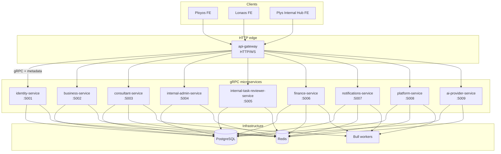
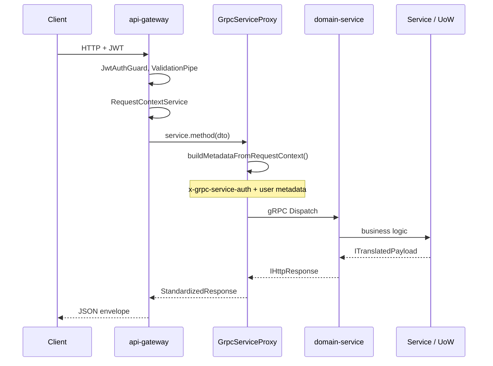

# System Architecture

This document describes how the Plys marketplace backend is structured: services, communication paths, shared libraries, security boundaries, and cross-cutting patterns. It reflects the current Nx monorepo after splitting **profiles-service** / **projects-service** into domain-aligned microservices.

For table ownership and bounded contexts, see [domain-ownership.md](./domain-ownership.md). For deploy topology and env files, see [../deployment/overview.md](../deployment/overview.md).

---

## Overview

The backend is an **Nx + pnpm monorepo** with **ten runnable NestJS applications** (one HTTP edge + nine gRPC microservices) and shared libraries under `packages/`. Clients (**Ployos**, **Lonaos**, and **Plys Internal Hub**) talk **only to api-gateway** over HTTP and WebSocket. Domain logic runs in **gRPC-only microservices** that share one PostgreSQL schema and one Redis cluster during the current migration phase.

| Layer                              | Role                                                                                         |
| ---------------------------------- | -------------------------------------------------------------------------------------------- |
| **api-gateway**                    | HTTP/WS edge — auth guards, validation, throttling, Swagger, gRPC client dispatch            |
| **identity-service**               | Users, JWT sessions, SSO, admin OTP auth                                                     |
| **business-service**               | Business profiles, onboarding, projects, tasks, board, AI sync (Ployos)                      |
| **consultant-service**             | Consultant profiles, onboarding, skill exams, explore, membership, tasks (Lonaos)            |
| **internal-admin-service**         | Admin onboarding questions, consultant onboarding review, skill exam admin, AI context admin |
| **internal-task-reviewer-service** | Task review rounds, voting, completion payout orchestration                                  |
| **finance-service**                | Wallets, payments, billing, webhooks                                                         |
| **notifications-service**          | Notification persistence, event handlers, skill-match queue                                  |
| **platform-service**               | Files, skills, housekeeping, health (slim platform)                                          |
| **ai-provider-service**            | AI provider keys, chat sessions, project AI context, bootstrap                               |

Legacy **`profiles-service`** / **`projects-service`** are decommissioned; production traffic uses the services above.

---

## Service topology



### Port map

| Service                        | HTTP                                             | gRPC | Notes                                          |
| ------------------------------ | ------------------------------------------------ | ---- | ---------------------------------------------- |
| api-gateway                    | `PORT` (3000 local, 4001 dev VPS, 4000 prod VPS) | —    | Fastify; global prefix `api`, URI version `v1` |
| identity-service               | —                                                | 5001 | Auth domain                                    |
| business-service               | —                                                | 5002 | Business / projects (Ployos)                   |
| consultant-service             | —                                                | 5003 | Consultant domain (Lonaos)                     |
| internal-admin-service         | —                                                | 5004 | Internal admin (Plys Hub)                      |
| internal-task-reviewer-service | —                                                | 5005 | Task reviewer                                  |
| finance-service                | —                                                | 5006 | Finance + webhook queue                        |
| notifications-service          | —                                                | 5007 | Notifications + skill-match queue              |
| platform-service               | —                                                | 5008 | Files, skills, housekeeping                    |
| ai-provider-service            | —                                                | 5009 | AI keys, chat, context                         |

gRPC URLs are resolved by `EnvironmentsService` from `*_GRPC_URL` or `GRPC_HOST` + `*_GRPC_PORT` (see `env/.env.example`).

---

## API gateway: HTTP `v1/{service}/` layout

HTTP controllers live under `apps/api-gateway/src/http/v1/`. Each folder maps to a gRPC backend and registers an `*HttpModule` in `app.module.ts`.

| Folder                                   | gRPC target                    | Primary clients                                 |
| ---------------------------------------- | ------------------------------ | ----------------------------------------------- |
| `gateway/`                               | —                              | Health, gateway metadata                        |
| `identity/`                              | identity-service               | Auth, admin allowed emails                      |
| `business/`                              | business-service               | Ployos — projects, board, profiles, dashboard   |
| `consultant/`                            | consultant-service             | Lonaos — explore, tasks, onboarding, exams      |
| `internal-admin/`                        | internal-admin-service         | Plys Hub — admin CRUD                           |
| `internal-task-reviewer/`                | internal-task-reviewer-service | Task review APIs                                |
| `finance/`                               | finance-service                | Payments, billing, webhooks                     |
| `notifications/`                         | notifications-service          | REST notifications + **WebSocket** gateway      |
| `platform/`                              | platform-service               | Files, skills                                   |
| `ai-provider/`                           | ai-provider-service            | AI bootstrap, chat sessions, BFF keys           |
| `shared/`                                | —                              | gRPC proxy helpers, auth providers (not routed) |
| `_legacy_profiles/`, `_legacy_projects/` | —                              | Deprecated; do not add routes                   |

Controllers delegate to domain services via **`createGrpcServiceProxy()`** (`http/v1/shared/grpc-service-proxy.util.ts`) and typed gRPC clients under `apps/api-gateway/src/clients/v1/{service}/`.

Public URL pattern: `/api/v1/...` (Nest `setGlobalPrefix('api')` + `VersioningType.URI` default version `1`).

---

## Request path: HTTP → gRPC → domain

The gateway does **not** query the database directly. Each HTTP handler invokes a gRPC `Dispatch` on the target microservice; services expose `*GrpcController` handlers that call the same service layer used for domain logic.



### gRPC contracts and bridge

- **Shared HTTP-over-gRPC wrapper**: `packages/proto/common/v1/http.proto`
- **Per-domain protos**: canonical copies under `packages/proto/{domain}/v1/`; some apps also keep `apps/{service}/protos/v1/` for code generation
- **Service auth**: `x-grpc-service-auth` validated against `GRPC_SERVICE_SECRET`
- **Context**: user/session fields in gRPC metadata → `RequestContextService` before handlers run

---

## EnvironmentsService

`EnvironmentsService` (`packages/common-nest/modules/environments/environments.service.ts`) is the **single typed configuration surface** for every app:

- Loads env via `resolveEnvFilePath()` → `env/.env.{local|dev|prod}`
- Runs `assertEnvSecretsValid()` on module init (dev/prod hardening)
- Exposes DB, Redis, JWT, CORS (`allowedOrigins`, `corsAllowLocalhost`), payment, S3, AI key versions, frontend URLs (`ployosUrl`, `lonaosUrl`, `internalHubUrl`)
- Resolves **all nine** backend gRPC URLs (`identityServiceGrpcUrl` … `aiProviderServiceGrpcUrl`)
- WebSocket limits: `wsMaxConnectionsPerUser`, `wsConnectRateLimitPerMinute`

api-gateway uses it for CORS, throttling Redis, port, and `waitForGrpcBackendsFromProcessEnv()` at bootstrap.

---

## Per-service protos and Unit of Work

| Service                        | Proto package(s)                                        | UoW modules (typical)                                                                              |
| ------------------------------ | ------------------------------------------------------- | -------------------------------------------------------------------------------------------------- |
| identity-service               | `packages/proto/identity/v1`                            | `UnitOfWorkModule`                                                                                 |
| business-service               | `packages/proto/business/v1`, `apps/.../business.proto` | `AppUnitOfWorkModule` → `ProfilesUnitOfWorkModule`, `ProjectsUnitOfWorkModule`, `UnitOfWorkModule` |
| consultant-service             | `packages/proto/consultant/v1`                          | `AppUnitOfWorkModule` (profiles + projects repos)                                                  |
| internal-admin-service         | `packages/proto/internal-admin/v1`                      | `AppUnitOfWorkModule` (profiles + projects + core)                                                 |
| internal-task-reviewer-service | `packages/proto/internal-task-reviewer/v1`              | `AppUnitOfWorkModule`                                                                              |
| finance-service                | `packages/proto/finance/v1`                             | `UnitOfWorkModule`                                                                                 |
| notifications-service          | `packages/proto/notifications/v1`                       | `AppUnitOfWorkModule`                                                                              |
| platform-service               | `packages/proto/platform/v1`                            | `UnitOfWorkModule`                                                                                 |
| ai-provider-service            | `packages/proto/aiprovider/v1`                          | `AppUnitOfWorkModule` → `ProjectsUnitOfWorkModule`                                                 |

Domain repositories stay in `packages/unit-of-work/`; services import only the UoW slices they need.

---

## Packages

Shared code is published as **`@plys/libraries`** with subpath exports from `packages/`.

| Package                   | Purpose                                                                 |
| ------------------------- | ----------------------------------------------------------------------- |
| `proto`                   | gRPC `.proto` files and `GRPC_METADATA_KEYS`                            |
| `database`                | TypeORM entities, migrations, seeds, `COMPOSITE_TRANSACTION_FLOWS`      |
| `config`                  | Env file resolution, secret validation                                  |
| `common-nest`             | Guards, filters, interceptors, gRPC helpers, Redis, EnvironmentsService |
| `unit-of-work`            | Repository layer + `UnitOfWorkService`                                  |
| `shared-kernel`           | Error code constants                                                    |
| `transaction-coordinator` | `SharedDbTransactionCoordinator` for cross-port SQL transactions        |
| `ai-provider-key`         | AI provider key vault + BFF envelope encryption                         |
| `profiles-port`           | `IProfilesReader` / `IProfilesLedger` port interfaces                   |
| `notifications`           | `NotificationsDispatchModule` for cross-service event emit              |

Versioning: [versioning.md](./versioning.md).

---

## Data layer

### PostgreSQL

- Single logical schema; all services connect via TypeORM (`packages/database/typeorm.config.ts`).
- Migrations run on startup in non-local envs when configured (`migrationsRun: true`).
- **Connection pooling** — `DB_POOL_MAX` per process.
- **Naming** — constraints/indexes: `prefix_table_column`.

### Redis

- Session-adjacent state, rate limiting, response caching, Bull backing store
- Socket.IO **Redis adapter** on api-gateway; notification fan-out via notifications-service + Redis

### Bull queues (current owners)

| Queue                      | Service               | Purpose                               |
| -------------------------- | --------------------- | ------------------------------------- |
| `finance-webhooks`         | finance-service       | Async Polar/Stripe webhook processing |
| `skill-match-notification` | notifications-service | Skill-match notification fan-out      |
| `skill-exam`               | consultant-service    | AI evaluation pipeline                |
| `housekeeping`             | platform-service      | Scheduled maintenance                 |

---

## Security architecture

| Layer           | Mechanism                                     | Where                           |
| --------------- | --------------------------------------------- | ------------------------------- |
| End-user API    | JWT + session re-validation                   | api-gateway `JwtAuthGuard`      |
| BFF-only routes | `x-api-key` → `PUBLIC_ENDPOINT_API_KEY`       | Register, explore, AI key fetch |
| Admin           | JWT + `ADMIN_PLATFORM` + OTP whitelist        | Internal admin routes           |
| gRPC internal   | `x-grpc-service-auth` → `GRPC_SERVICE_SECRET` | All microservice `Dispatch`     |
| Webhooks        | Provider signatures                           | finance-service workers         |

AI provider keys: AES-256-GCM at rest; BFF envelope under `FE_BFF_SECRET_v<N>`.

---

## Cross-cutting patterns

### Request context

`RequestContextService` (AsyncLocalStorage): `userId`, `email`, `userRole`, `sessionId`, `activePlatform`, `businessId`, `requestId`, `deviceId`, `locale`, `timezone`, `idempotencyKey`.

### Standardized HTTP response

See [../api/common-response.md](../api/common-response.md). Controllers return `{ messageKey, data }`; `TransformResponseInterceptor` and `GlobalExceptionFilter` build the envelope.

### Clients and platforms

| Client            | `ActivePlatform`         | Product                    |
| ----------------- | ------------------------ | -------------------------- |
| Ployos            | `BUSINESS`               | Ployos                     |
| Lonaos            | `CONSULTANT`             | Lonaos                     |
| Plys Internal Hub | `ADMIN`, `TASK_REVIEWER` | Internal admin / reviewers |

### Notifications (realtime)

| Component                | Location                             | Role                           |
| ------------------------ | ------------------------------------ | ------------------------------ |
| `NotificationsGateway`   | api-gateway `http/v1/notifications/` | WS auth, rooms `user:{userId}` |
| `RedisIoAdapter`         | api-gateway bootstrap                | Cross-replica Socket.IO        |
| Notification handlers    | notifications-service                | Persist + emit events          |
| Postgres `notifications` | notifications-service                | Source of truth                |

See [notifications-realtime-api-specs.md](../api-specs/shared/notifications-realtime-api-specs.md).

### Composite transactions

Multi-table flows that must stay atomic use `SharedDbTransactionCoordinator` (`packages/transaction-coordinator/`). See [transaction-inventory.md](./transaction-inventory.md).

---

## Domain boundaries

Services must not import each other's application source (ESLint). Cross-context access uses ports or `@plys/libraries` packages.

Full matrix: [domain-ownership.md](./domain-ownership.md).

---

## Testing

```bash
pnpm test
pnpm exec jest --config apps/finance-service/jest.config.js
pnpm exec jest --config packages/jest.config.js
```

---

## Related documentation

| Document                                                           | Topic                             |
| ------------------------------------------------------------------ | --------------------------------- |
| [domain-ownership.md](./domain-ownership.md)                       | Table ownership, bounded contexts |
| [transaction-inventory.md](./transaction-inventory.md)             | Composite SQL transactions        |
| [versioning.md](./versioning.md)                                   | Library semver / HTTP v1 layout   |
| [../api/common-response.md](../api/common-response.md)             | Response envelope                 |
| [../api/error-codes.md](../api/error-codes.md)                     | Error code catalog                |
| [../deployment/overview.md](../deployment/overview.md)             | Docker, CI/CD, env vars           |
| [../integration/ai-chat-flows.md](../integration/ai-chat-flows.md) | AI BFF integration                |
| [../api-specs/](../api-specs/)                                     | Per-endpoint API specifications   |
